# BPAY Agent - Flow Diagrams

This document contains Mermaid diagrams illustrating the various flows, sequences, and relationships in the BPAY Agent system.

---

## 1. System Architecture Diagram

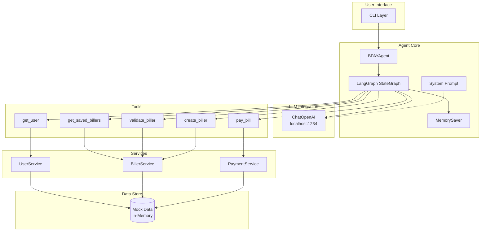

---

## 2. LangGraph State Machine

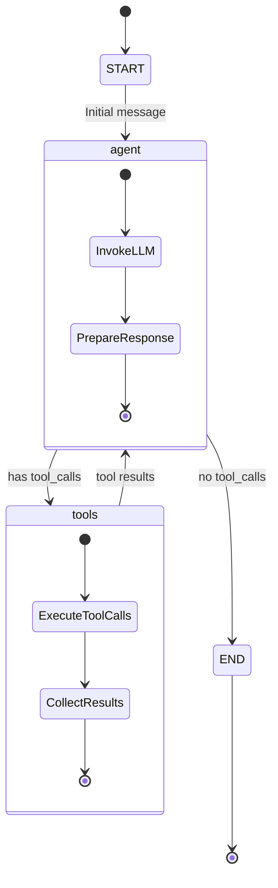

---

## 3. Message Processing Sequence

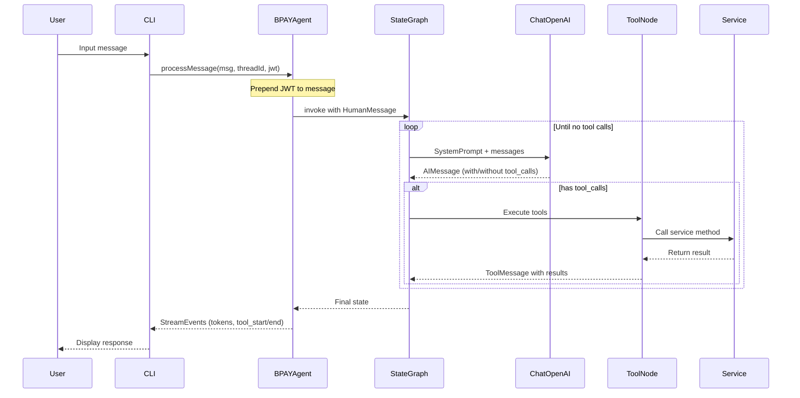

---

## 4. Bill Payment Flow

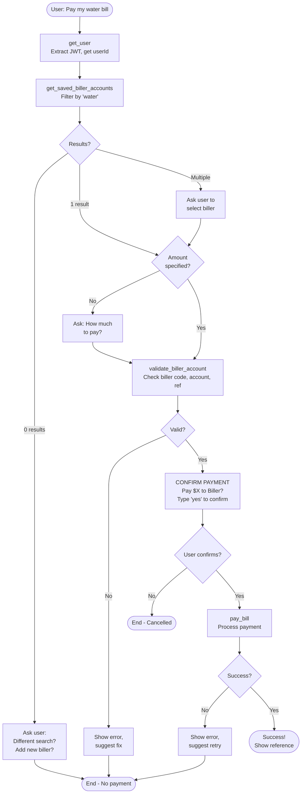

---

## 5. Tool Execution Sequence

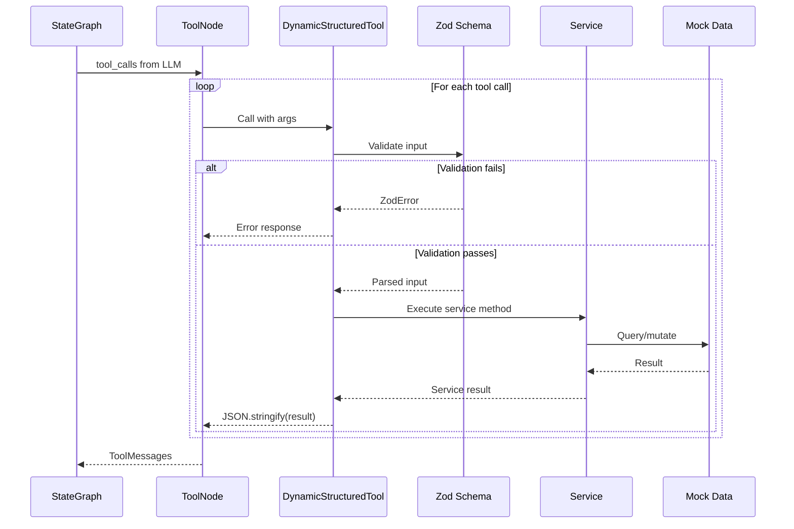

---

## 6. Service Layer Class Diagram

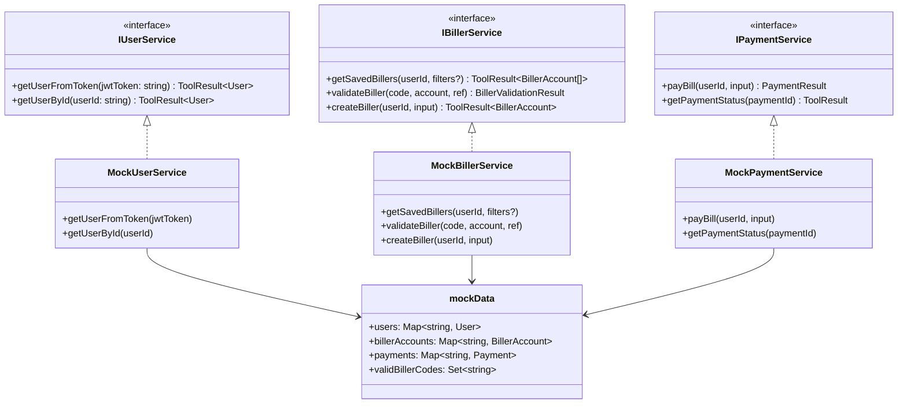

---

## 7. Type Hierarchy

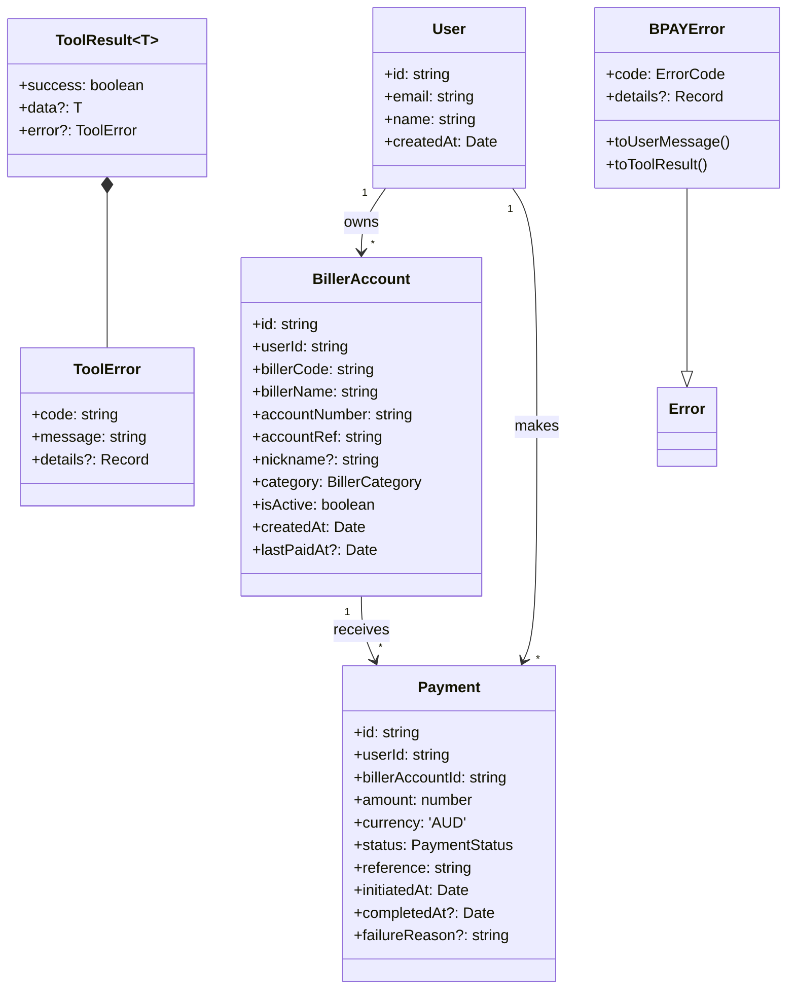

---

## 8. CLI Interaction Flow

```mermaid
flowchart TD
    START([Start CLI]) --> WELCOME[Show Welcome]
    WELCOME --> PROMPT[Prompt: "You: "]

    PROMPT --> INPUT{User Input}

    INPUT -->|Empty| PROMPT
    INPUT -->|exit/quit/q| GOODBYE[Show Goodbye]
    INPUT -->|clear| CLEAR[Reset threadId]
    INPUT -->|help| HELP[Show Help]
    INPUT -->|Other| PROCESS

    CLEAR --> PROMPT
    HELP --> PROMPT
    GOODBYE --> END([Exit])

    PROCESS[Process with Agent]
    PROCESS --> STREAM{Stream Events}

    STREAM -->|token| WRITE[Write to stdout]
    STREAM -->|tool_start| TOOL_START[Show tool name]
    STREAM -->|tool_end| TOOL_END[Show completion]
    STREAM -->|error| ERROR[Show error]
    STREAM -->|final| DONE[Ensure newline]

    WRITE --> STREAM
    TOOL_START --> STREAM
    TOOL_END --> STREAM
    ERROR --> PROMPT
    DONE --> PROMPT
```

---

## 9. Streaming Event Flow

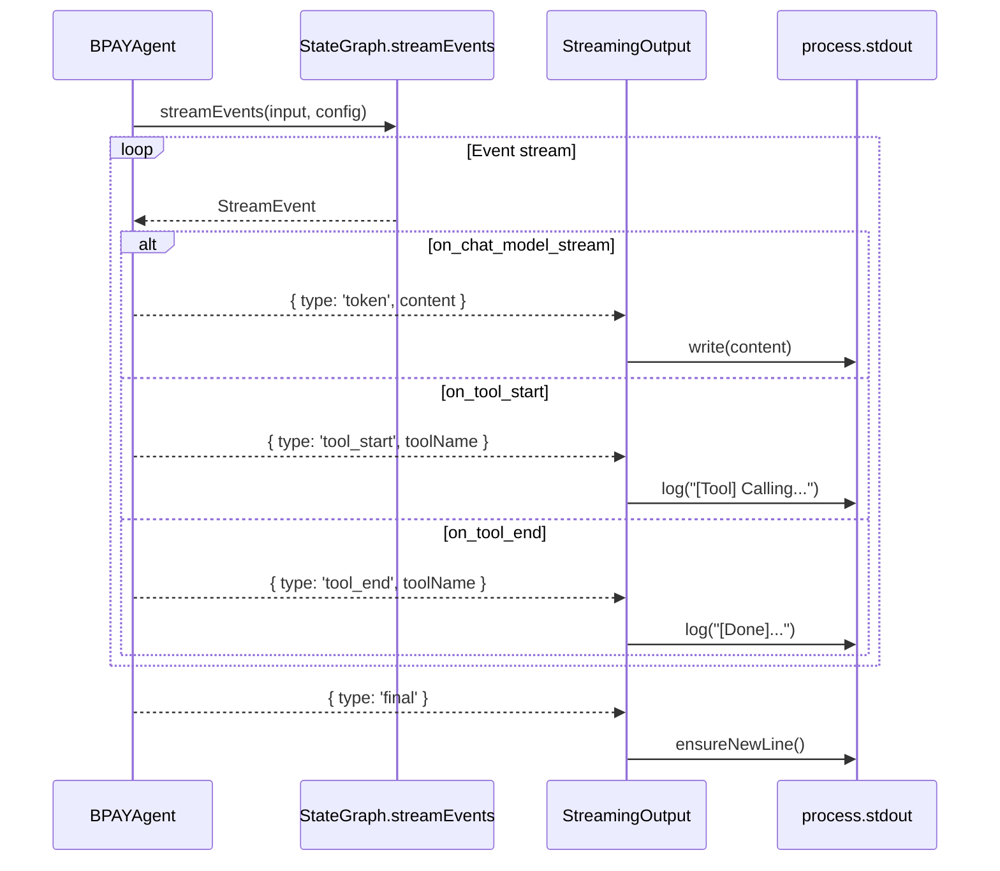

---

## 10. Error Handling Flow

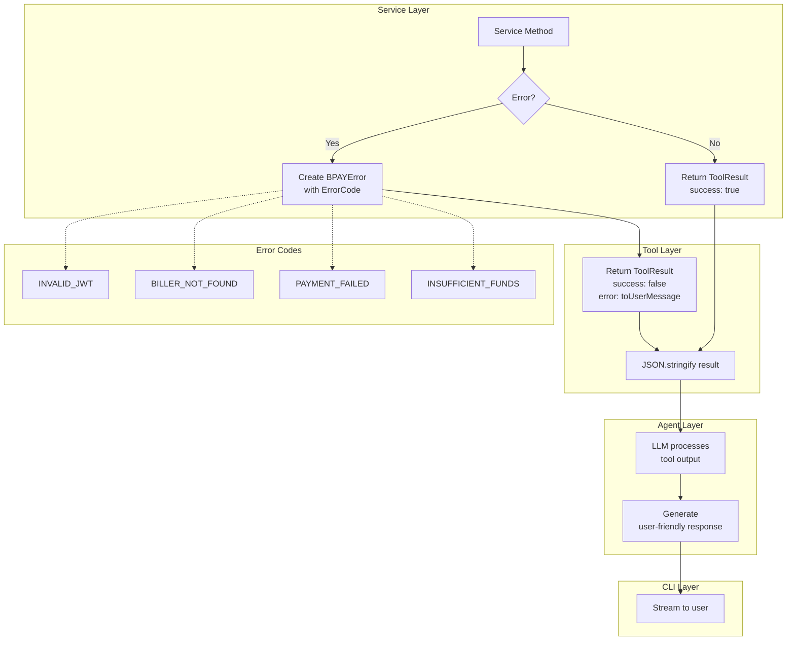

---

## 11. Human-in-the-Loop Decision Points

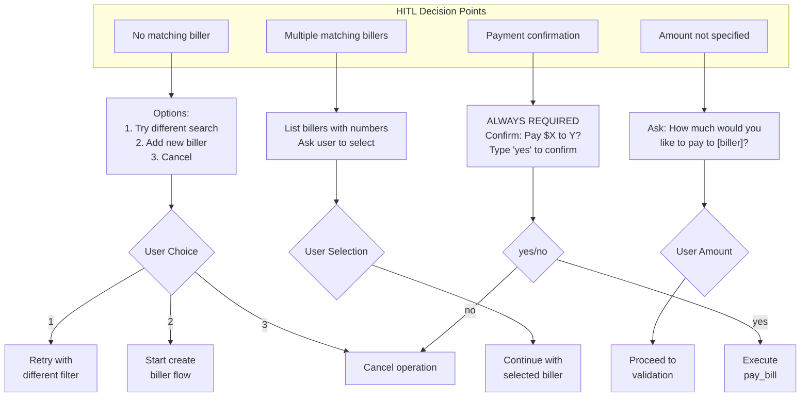

---

## 12. Module Dependency Graph

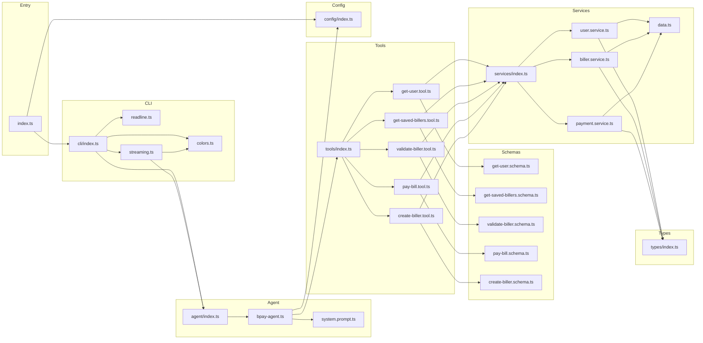

---

## 13. Conversation State Management

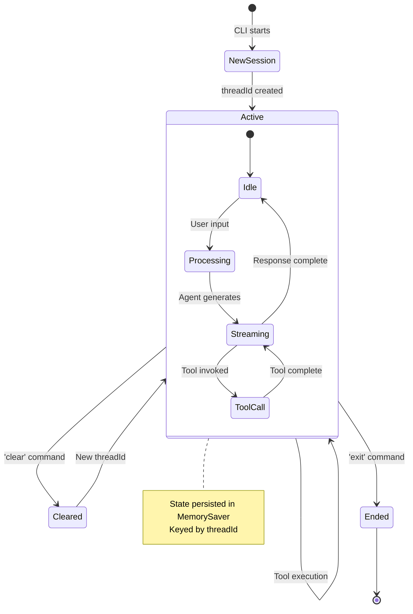
