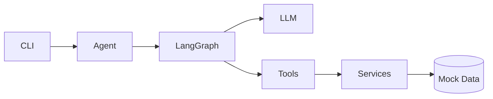
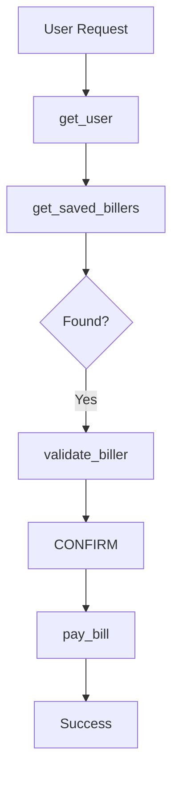

# BPAY Agent - Code Analysis Report

> **Comprehensive analysis of the BPAY bill payment agent codebase**
> Generated: November 2024

---

## Document Index

| Document | Description | Key Topics |
|----------|-------------|------------|
| [01-ARCHITECTURE-OVERVIEW.md](./01-ARCHITECTURE-OVERVIEW.md) | High-level system architecture | Technology stack, layer diagram, data flow |
| [02-MODULE-DOCUMENTATION.md](./02-MODULE-DOCUMENTATION.md) | Detailed function-level documentation | Every module, class, and method |
| [03-FLOW-DIAGRAMS.md](./03-FLOW-DIAGRAMS.md) | Mermaid diagrams | State machines, sequences, class diagrams |
| [04-DESIGN-DECISIONS.md](./04-DESIGN-DECISIONS.md) | Design rationale | Why decisions were made |
| [05-ISSUES-AND-SOLUTIONS.md](./05-ISSUES-AND-SOLUTIONS.md) | Current gaps and fixes | Security, testing, production readiness |

---

## Quick Summary

### What is this?

A conversational AI agent for BPAY (Australian bill payment system) built with:
- **LangChain.js** for LLM orchestration
- **LangGraph** for stateful agent workflows
- **TypeScript** for type safety
- **Zod** for runtime validation

### Architecture at a Glance

```
User → CLI → BPAYAgent → LangGraph → LLM
                            ↓
                         Tools → Services → Mock Data
```

### Key Components

| Component | Purpose | Files |
|-----------|---------|-------|
| **Agent** | AI orchestration | `src/agent/bpay-agent.ts` |
| **Tools** | LLM-callable functions | `src/tools/*.ts` |
| **Services** | Business logic | `src/services/mock/*.ts` |
| **CLI** | User interface | `src/cli/*.ts` |

### Available Tools

| Tool | Purpose |
|------|---------|
| `get_user` | Authenticate via JWT |
| `get_saved_biller_accounts` | Query saved billers |
| `validate_biller_account` | Validate biller details |
| `pay_bill` | Execute payment |
| `create_biller_account` | Add new biller |

---

## Key Findings

### Strengths

1. **Clean Architecture**: Clear separation of concerns across layers
2. **Type Safety**: Full TypeScript with Zod validation
3. **Extensibility**: Interface-based services for easy swapping
4. **Streaming Support**: Real-time token output
5. **Human-in-the-Loop**: Prompt-based confirmation rules

### Critical Issues

1. **No programmatic payment confirmation** - Relies on prompt only
2. **JWT exposed in conversation history** - Security concern
3. **No actual JWT validation** - Mock only

### Production Gaps

- No unit/integration tests
- No rate limiting
- No payment idempotency
- No structured logging
- Hardcoded LLM URL

---

## Diagram Highlights

### System Architecture


### Payment Flow


---

## Quick Start

```bash
# Environment setup
cp .env.example .env
# Add your API key

# Run the agent
npm start

# Example interaction
You: Pay my water bill $50
Assistant: [Calls tools, asks for confirmation]
You: yes
Assistant: Payment successful! Reference: REF123ABC
```

---

## Next Steps

For detailed analysis, start with:
1. **[Architecture Overview](./01-ARCHITECTURE-OVERVIEW.md)** - Understand the big picture
2. **[Flow Diagrams](./03-FLOW-DIAGRAMS.md)** - Visual understanding
3. **[Issues & Solutions](./05-ISSUES-AND-SOLUTIONS.md)** - What needs fixing

For code-level understanding:
1. **[Module Documentation](./02-MODULE-DOCUMENTATION.md)** - Every function explained
2. **[Design Decisions](./04-DESIGN-DECISIONS.md)** - Why it's built this way

---

## File Statistics

| Category | Files | Lines (approx) |
|----------|-------|----------------|
| Agent | 3 | 200 |
| Tools | 10 | 300 |
| Services | 7 | 250 |
| CLI | 4 | 200 |
| Types | 5 | 100 |
| Config/Utils | 2 | 80 |
| **Total** | **31** | **~1,130** |

---

## License

This analysis is part of the BPAY Agent project documentation.
